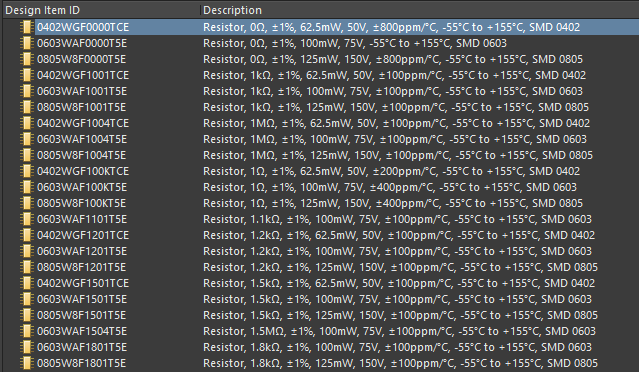

# Altium Libraries for JLCPCB Parts

This repository contains automatically generated libraries for a range of parts in JLCPCB's catalogue.

Component information is pulled from JLCPCB's website, parsed into an intermediate JSON format, and a SchLib file is directly generated using my unreleased .NET library for Altium documents.

The current library files are:

 - `jlcpcb_basic_resistors.schlib` - All 0402, 0603, and 0805 package resistors in the JLCPCB basic parts catalogue (approximately 256 parts)
 - `jlcpcb_basic_capacitors.schlib` - All 0402, 0603, and 0805 package capacitors in the JLCPCB basic parts catalogue (approximately 109 parts)
 - `jlcpcb_extended_capacitors.schlib` - All MLCC capacitors in package sizes 01005, 0201, 0402, 0603, 0805, 1008, 1206, 1210, 1806, 1812, 2010, 2512, and 2910 in the JLCPCB extended parts catalogue, excluding parts that were out of stock at the time of generation (approximately 10148 parts)

## Common Parameters

All parts have the following parameters set:

- Manufacturer
- Manufacturer Part Number
- JLCPCB Part Number
- JLCPCB Basic Part ("Yes" or "No")
- Package Size
- Category
- Datasheet link
- JLCPCB Part URL link

Each component references a footprint named with the format `TYPE-SIZE`, e.g. `RES-0603` or `CAP-0805`, in any loaded library. All you need is a PcbLib with those three footprints (you can create them with the IPC Footprint Wizard if you don't already have suitable ones) and they'll automatically be picked up from there within your project.

## Resistors

Each resistor has the following parameters populated if they are present in the JLCPCB/LCSC parametric data, in addition to the common parameters:

- Resistance
- Tolerance
- Power Rating
- Voltage Rating
- Temperature Rating
- Temperature Coefficient

## Capacitors

Each capacitor has the following parameters populated if they are present in the JLCPCB/LCSC parametric data:

- Capacitance
- Tolerance
- Voltage Rating
- Temperature Coefficient
- Temperature Rating

